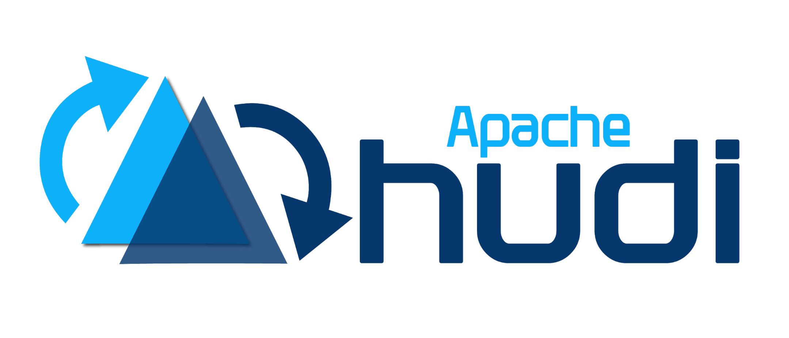
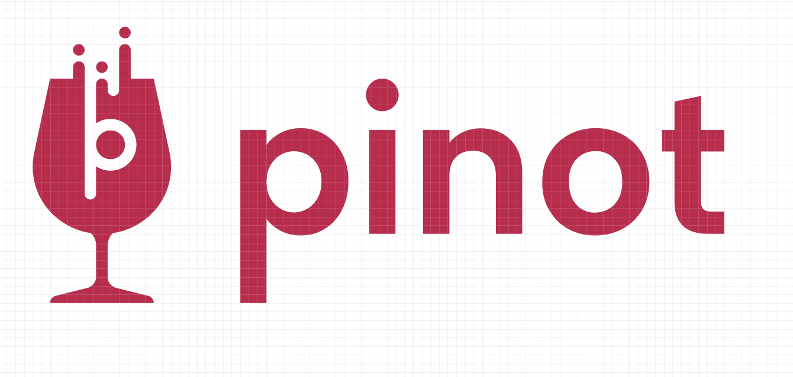

# Data Platform Stack Summary

`Summaries of awesome tech stacks used for data platform`

## Contents

### [Apache Hudi](https://hudi.apache.org/)

Apache Hudi is an open-source transactional data lake platform designed to bring database-like functionality to data lakes. It supports efficient incremental processing, ACID transactions, and real-time analytics, making it suitable for handling both batch and streaming data. Hudi is particularly valuable for applications needing rapid data updates, such as e-commerce, fraud detection, and machine learning pipelines.

[document](./docs/hudi.md)

---

### [Apache Pinot](https://pinot.apache.org/)

Apache Pinot is a real-time distributed OLAP datastore designed to provide ultra-low-latency analytics on large datasets, allowing for fast, scalable insights. It supports both batch and streaming data ingestion, making it ideal for user-facing applications that require high throughput and low-latency query execution​.

